# Clusters of News Headlines

For more information, read Report.pdf (in Portuguese) or contact me.

## Activities

* Dataset preprocessing and feature extraction;
* TF-IDF, K-mens and the choice of K;

## The dataset
Million News Headlines contains 1 million data published over a 15-year period by Australian news source ABC (Australian Broadcasting Corp.).

| Year     | Samples  |   Year     |   Samples         |
|---|-------|-------|---------|
| 2003    |   59343   |   2011    |   69919   |
| 2004    |   65975   |   2012    |   78547  |
| 2005    |   66320   |   2013    |   81016  |
| 2006    |   61568   |   2014    |   73361  |
| 2007    |   69431   |   2015    |   70004   |
| 2008    |   71591   |   2016    |   52162  |
| 2009    |   68867   |   2017    |   44182  |
| 2010    |   67715   |     |

## Pre-processing
* Conversion to lowercase;
* Punctuation removal;
* Removal of words with size less than or equal to 2;
* Stemming;
* Removal of numbers.

## Feature Extration
Bag of Words

## TF-IDF
## K-Means

### Methods for choosing K
Elbow and Silhouette analysis.

## PCA e t-SNE
Principal component analysis (PCA) and T-Distributed Stochastic Neighbouring Entities (t-SNE).

## Experiments with the whole dataset

* Removal of stopwords;
* Disregarding words that appears in over 50% of documents;
* Disregarding words that do not occur in by at least 5 documents, to 1-gram, going up to 2 documents to 4-gram (with increasing gram, the amount of repetition in documents decreases);

### Experiment 1

* Features: 500;
* Dataset: 10%;
* Feature extraction: 1-gram, 2-gram, 3-gram and 4-gram;
* K: between: 2 and 250.

#### Elbow

  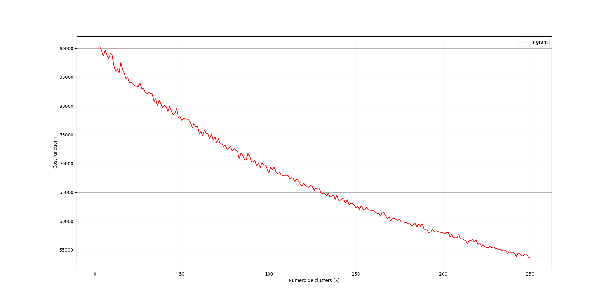

  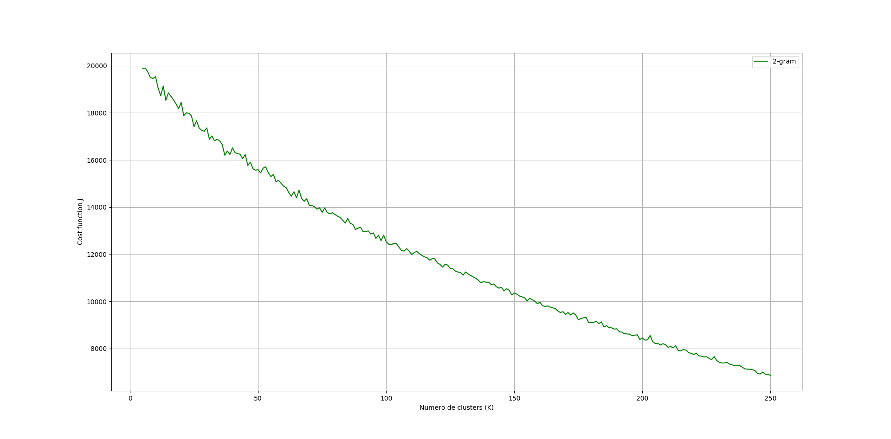

  

  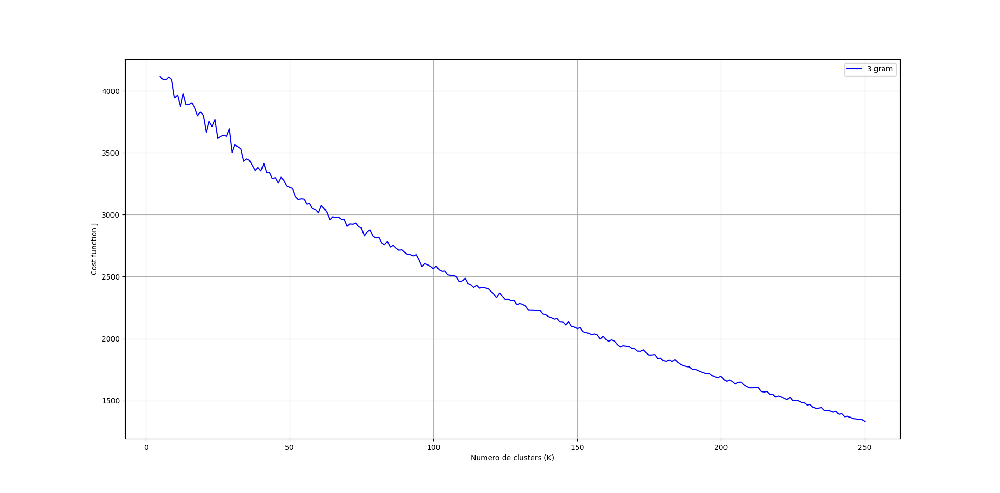

  

  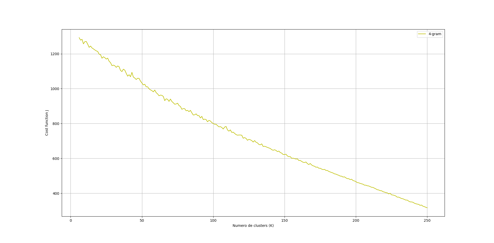

    
#### Silhouette analysis

  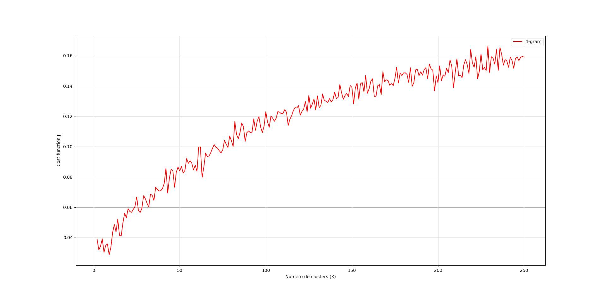

  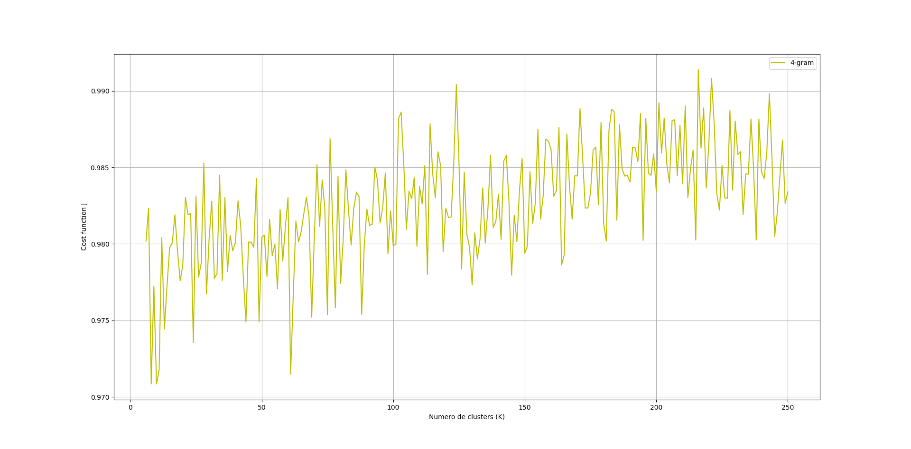

### Experiment 2

* Features: 1000;
* Dataset: 10%;
* Feature extraction: 1-gram, 2-gram, 3-gram and 4-gram;
* K: between: 2 and 100.

  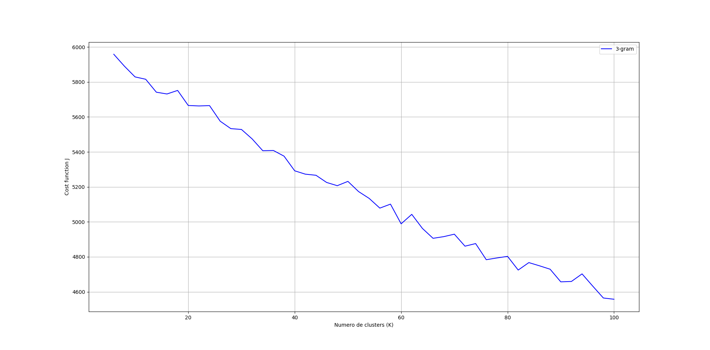

### Experiment 3

* Removal of duplicate headlines (643715 examples left);
* The entire dataset was used (without duplicate values);
* 10,000 features were considered;
* 2 <= K <= 20.

  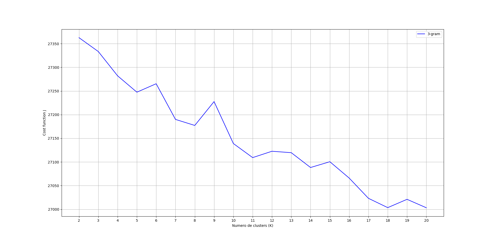

  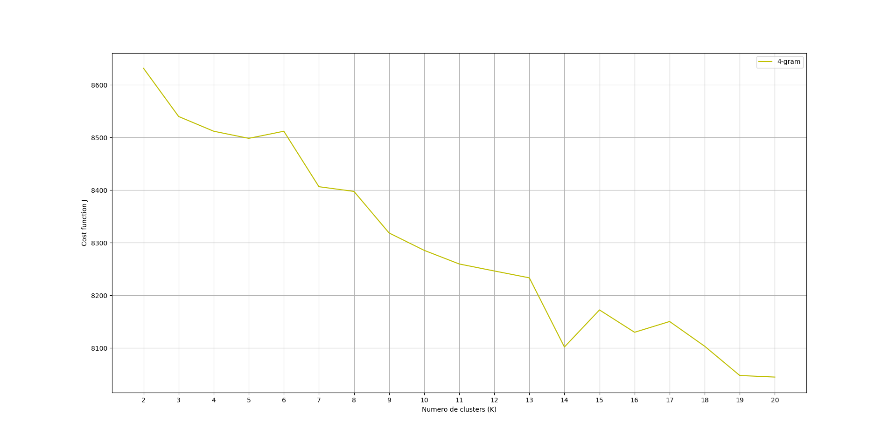

| Grams  | K                             |
|------|-------|
| 1-gram | 4, 6, 9, 10, 12, 13, 15, 16, 18, 19      |
| 2-gram | 2, 3, 4, 5, 7, 8, 10, 11, 12, 15, 17, 19 |
| 3-gram | 3, 5, 8, 9, 12, 14, 16, 17              |
| 4-gram | 5, 7, 8, 9, 11, 14, 16, 18, 19         |

| Gram   | K  | Silhouette |
|----|-----|-----|
| 1-gram | 5  | 0.0154    |
| 1-gram | 12 | 0.0233    |
| 4-gram | 5  | 0.9719     |
| 4-gram | 12 | 0.9761      | 

**Cluster 1**: vic countri hour podcast, rural qld rural report, rural nsw rural report, sa countri hour podcast, nation rural news wednesday, man face court accus, aung san suu kyi, test day live blog, nation rural news tuesday, speak abc news breakfast;

**Cluster 2**: nation rural news monday, youth mental health servic, form guid men m, gold coast man face, gold coast light rail, gold coast hit run, gold coast high rise, gold coast commonwealth game, given suspend jail term, given good behaviour bond;

**Cluster 3**: nsw countri hour wednesday, countri hour wednesday decemb, countri hour wednesday septemb, countri hour wednesday novemb, countri hour wednesday april, countri hour wednesday june, countri hour wednesday octob, countri hour wednesday januari, countri hour wednesday august, countri hour wednesday februari;

**Cluster 4**: tas countri hour friday, countri hour friday octob, countri hour friday april, countri hour friday june, countri hour friday august, countri hour friday juli, countri hour friday march, countri hour friday novemb, heavi rain caus flood, heavi rain caus flash;

**Cluster 5**: wa countri hour podcast, countri hour podcast octob, countri hour podcast th, countri hour podcast decemb, countri hour podcast septemb, countri hour podcast juli, countri hour podcast august, countri hour podcast februari, countri hour podcast januari, countri hour podcast march.
    
## Experiments by year
 
| Ano  | K                   | Ano  | K                    | 
| -----| -----| ----| -----| 
| 2003 | 3, 5, 8, 11, 16     | 2011 | 3, 5, 11             |
| 2004 | 3, 6, 9, 11, 15     | 2012 | 3, 5, 8, 13, 16      |
| 2005 | 4, 6, 9, 11, 13, 18 | 2013 | 4, 7, 10, 13, 15     |
| 2006 | 3, 8, 11, 13, 15    | 2014 | 3, 7, 10, 14         |
| 2007 | 3, 5, 6, 10, 18     | 2015 | 5, 8, 11, 14, 16     |
| 2008 | 4, 8, 13, 16, 19    | 2016 | 4, 6, 10, 13, 17     |
| 2009 | 4, 9, 13, 15, 18    | 2017 | 4, 8, 10, 12, 15, 17 | 

## Cluster visualization

  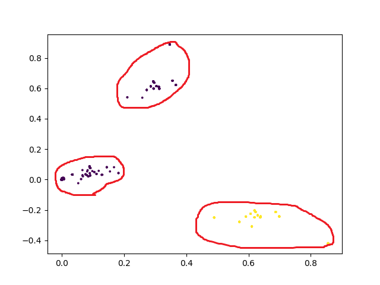

  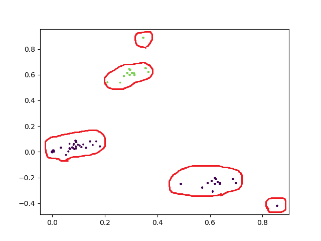

